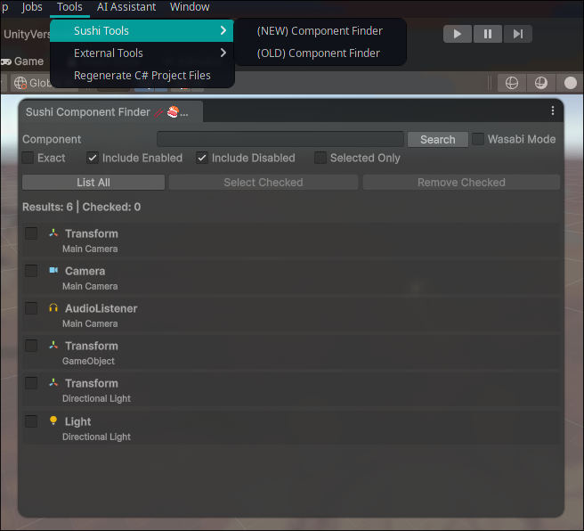

# Sushi Component Finder

A Unity Editor tool for searching, selecting, and removing components across GameObjects in the current scene.

## Installation

### Install from Git URL

1. Open your Unity project.

2. Open:

   **Window → Package Manager**

3. Click the **+** button in the top-left.

4. Select:

   **Add package from git URL...**

5. Enter:

   `https://github.com/tuserl/SushiComponentFinder.git`

6. Click **Add**.

Unity will download and install the package automatically.

### Install a specific version

You can also install a specific Git tag:

`https://github.com/tuserl/SushiComponentFinder.git#1.0.0`

This installs version `1.0.0`.

## Usage

After installation, open the tool from:

**Tools → Sushi Tools → Component Finder**

You can:

* Search for components by name
* Search for an exact component name
* List all components in the scene
* Select multiple components
* Select the corresponding GameObjects
* Remove selected components
* Remove selected GameObjects
* Copy component names and GameObject paths
* Use **Wasabi Mode** — your PC isn't slow, it's just eating wasabi. Wasabi Mode disables automatic searching while typing for better performance.

<!-- ## Requirements

Unity 2022.2 or newer.
-->

## License

MIT License
